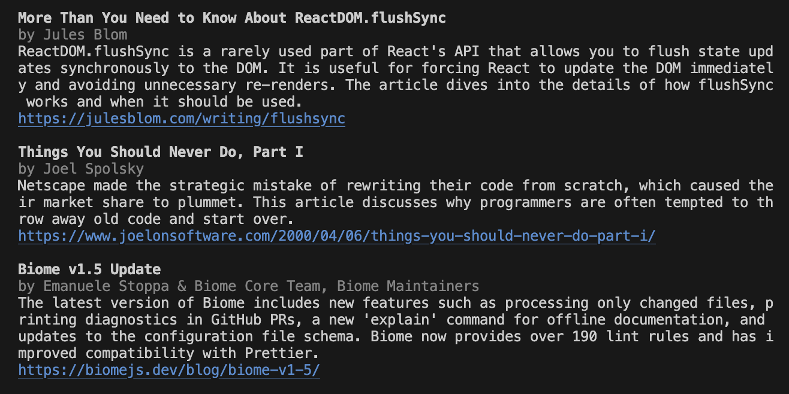

# Curator AI

[](https://common-changelog.org)

An AI-powered news curator. It reads a list of articles, selects the best ones depending on a list of interests, and summarizes them into an easy-to-read news feed. Powered by the OpenAI API.

## Requirements

-   Node.js >= 18
-   an [OpenAI API](https://platform.openai.com/) key

## Initialize the project

After cloning the repository, run the following command : 
```sh
make init
```
It will install every dependencies and create a .env file with all the required fields.

### Required .env fields
```sh
OPENAI_API_KEY= #Your OpenAI API key
SUPABASE_URL= #The URL to your supabase project (Connect > App Framework)
SUPABASE_ANON_KEY= #Key to your supabase project (Connect > App Framework)
POSTMARK_API_KEY= #Key to your postmark project
DEFAULT_POSTMARK_MAIL= #Default postmark mail to send from
```

The supabase project at the moment only requires one table 'subscribers' with one value 'email'.

## Start the webpage

To run the webpage localy:
```sh
make webpage
```
For further information check [src/web/README.md](src/web).

## Test the mail

To test a sample formatted mail with some defined options on the curator, run :
```sh
make testMail
```
For further information check [src/script_curator/README.md](src/script_curator).

## CLI Usage

```sh
# Install the package globally
npm install -g curator-ai

# Summarize a list of articles based on aggregator URLs
OPENAI_API_KEY=XXX curate -a https://news.ycombinator.com/ https://lobste.rs/
```

Example output:



More options:

```sh
# Get usage information
curate

# Summarize a list of articles based on URLs passed directly as parameters
OPENAI_API_KEY=XXX curate -u https://example.com/article1 https://example.com/article2

# Summarize a list of articles based on a file containing URLs
OPENAI_API_KEY=XXX curate -uf myFile.txt

# Return at most 5 articles
OPENAI_API_KEY=XXX curate -a https://news.ycombinator.com/ -m 5

# Return the articles about AI and React
OPENAI_API_KEY=XXX curate -a https://news.ycombinator.com/ -i AI React

# Summarize a list of articles based on RSS feed
OPENAI_API_KEY=XXX curate -r https://afup.org/rss.xml -i event
```

You can also put the API key in a `.env` file:

```txt
OPENAI_API_KEY=XXX
```

Then you don't need to pass it as a parameter.

```sh
curate -f myFile.txt
```

## Programmatic Usage

```sh
# Install the package locally
npm install curator-ai
```

Put the API key in a `.env` file:

```txt
OPENAI_API_KEY=XXX
```

Use the `curate` function:

```js
const { curate } = require('curator-ai');

const links = [
    'https://stability.ai/news/stable-code-2024-llm-code-completion-release',
    'https://www.fromjason.xyz/p/notebook/where-have-all-the-websites-gone/',
    'https://www.joelonsoftware.com/2000/04/06/things-you-should-never-do-part-i/',
    'https://biomejs.dev/blog/biome-v1-5/',
    'https://birtles.blog/2024/01/06/weird-things-engineers-believe-about-development/',
    'https://julesblom.com/writing/flushsync',
];

curate({
    links,
    interests: ['react', 'ai'],
    max: 5,
}).then(curatedLinks => {
    console.log(curatedLinks);
});

// [
//  {
//    title: 'More Than You Need to Know About ReactDOM.flushSync',
//    author: 'Jules Blom',
//    summary: 'This article dives into the rarely used ReactDOM.flushSync function in React and explains what it does and when it is useful. It discusses how flushSync flushes state updates synchronously to the DOM, and why this is important. The article also explains the concept of batching in React updates and how flushSync can bypass the update queue.',
//    relevancy_score: 8,
//    link: 'https://julesblom.com/writing/flushsync'
//  },
//  ...
// ]
```

To execute the script for the curator
```sh
node src/script_curator/index.js
```

## Development

```sh
npm install

# Get usage information
npm start

# Summarize a list of articles based on aggregator URLs (notice the --):
npm start -- -a https://news.ycombinator.com/
```

Don't forget to pass a valid OpenAI key, either as an environment variable or in a `.env` file.

## Build

```sh
npm run build
npm publish
```

## License

MIT
